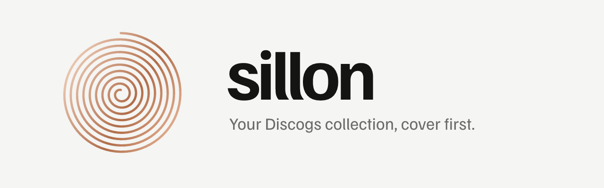

<picture>
  <source media="(prefers-color-scheme: dark)" srcset="docs/brand/readme-banner-dark.png">
  <source media="(prefers-color-scheme: light)" srcset="docs/brand/readme-banner-light.png">
  
</picture>

# Sillon

Your Discogs collection, cover first: a personal app for picking what to play.

## Features

- **Collection** — your Discogs Collection, Recent additions and Estimated value
- **Random pick** — one record from the whole Collection
- **Search** — artists, Discographies, Masters and Releases; scan a barcode to find a Release
- **Wantlist** — with a Fulfilled want prompt when a new record was on it
- **Marketplace** — Listing count, Lowest price and Suggested prices for a Release
- **Covers** — HD Covers from Deezer; a House sleeve when a record has none
- **PWA** — installable, Covers cached, works offline
- Light and dark, following the system or set by hand

## Design

_Sillon_ is French for the groove in a record. One spiral line is the mark,
the loader and the launch screen. Black, white and grey, with colour from
Covers and copper lacquer on brand moments. Square like a sleeve, round like a
record. See [`docs/design-system.md`](docs/design-system.md).

## Stack

- [TanStack Start](https://tanstack.com/start), [Router](https://tanstack.com/router) and [Query](https://tanstack.com/query)
- [Tailwind CSS v4](https://tailwindcss.com) + [shadcn/ui](https://ui.shadcn.com)
- Familjen Grotesk + Martian Mono, self-hosted
- Motion in CSS and the Web Animations API
- Discogs OAuth 1.0a for sign-in and Collection data
- Deezer API for HD Covers

## Development

```bash
pnpm install
pnpm dev                    # http://localhost:3000
pnpm test                   # vitest
pnpm check                  # prettier + eslint fix
pnpm generate:pwa-assets    # re-render icons, launch screens and README banners from the mark
```

Requires a `.env` file with Discogs API credentials:

```bash
DISCOGS_CONSUMER_KEY=
DISCOGS_CONSUMER_SECRET=
SESSION_SECRET=
```

## Status

In active development, migrated from Remix to TanStack Start.
The phased plan is in [`docs/roadmap.md`](docs/roadmap.md).
